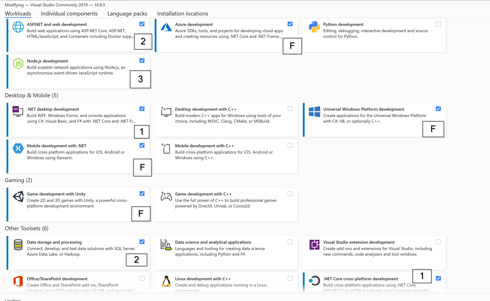
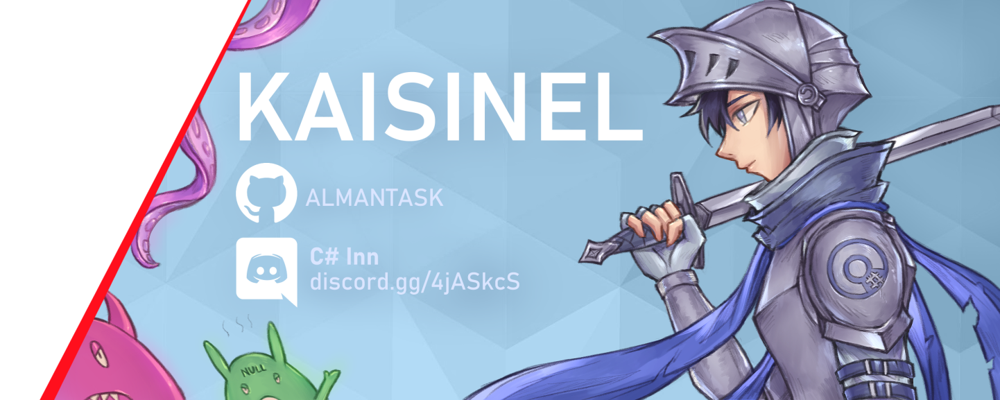

# From Zero To Hero

## The vision

"Programming is hard". Yes, but not harder than running a marathon for a person who has never run. It's not harder than 
building a house if you never built one. Programming is hard only until you practice it (like any other skill). 
I would like to invite you to learn programming following this course. 
Ignite passion for finding little miracles in code every day 🙂

## For new joiners

It's never too late to join, because the community is there, all the material is saved
and you will not be left alone.

### YouTube

Live lessons are streamed and uploaded on [YouTube channel: Full Stack Boot Camp: From Zero To Hero](https://www.youtube.com/watch?v=Onfuqjn8h0w&list=PLbwOopTjJke49hTBrmz8ayxQj_Zro4zrg&ab_channel=Kaisinel).
Live lessons start at **6PM UTC, Sunday**: 2h live-coding and then 1h consultations on voice chat.

### Discord

There is a helpful community with thousands of members to help you learn and answer your questions. 
Join us and find answers to questions that bother you: [C# Inn on Discord](https://discord.gg/rCMKcUU)

### Wiki

Lesson theory can be found in the [boot camp wiki](https://github.com/csinn/CSharp-From-Zero-To-Hero-v2/wiki).

#### Homework & Questions

Every lesson wiki ends with a homework and questions section.

### Checklist

Before you start, make sure you have the following:
- [Visual Studio Community Edition]( https://visualstudio.microsoft.com/vs/community/) with the configuration from below (numbers are for each month features. F stands for future- as in maybe we will use it).
- Git: https://git-scm.com/downloads
- Account on GitHub: https://github.com/

___
Never stop fighting, trying. Fail, rise and succeed.

